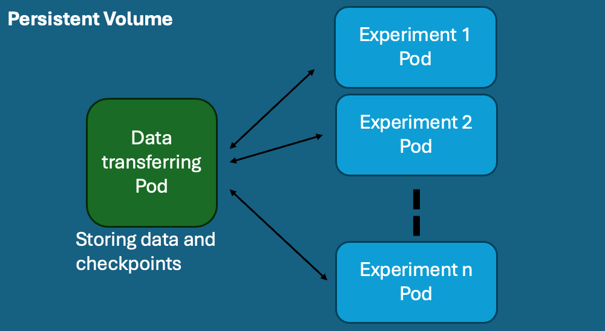

## DPC Demo 

Short demo/tutorial how you can use the AIML' shared computing resource, known as **Deep Puple Cluster (DPC)**. This is a different cluster than Phoenix and it can be used for any AIML member. Unlike Phoenix, DPC uses Kubernetes and Docker containers for deployment. In Kubernetes the Pod is the smallest deployable unit of computing.

Some advantages of using DPC:

* GPU availability (see the GPUs available below)
* You can run many experiments (it depends on availability)
* Option of running in multiple GPUs 
* Max. default storage of 1TB (you can ask Hui to get more temporal storage)
* Internet connection (great for recording the logs in real time - try [Wandb](https://wandb.ai/) 😀)

Cluster Composition

```
  1 x Ada A6000 Node
  1 x L40S Node
  8 x A100 Nodes
  3 x DGX Nodes (with V100 GPUs)
     - 1 x DGX-1 (8 GPUs)
     - 2 x DGX-2 (16 GPUs each)
```

There is already a [main tutorial](https://github.com/aiml-au) for DPC use, however, the current demo is created in a higher level (dummy demo).

### Steps 

First, clone this repository by running:

```
git clone https://github.com/victorcaquilpan/Tutorial-DPC-AIML.git
cd Tutorial-DPC-AIML
```

You need an @aiml.team account for accesing to DPC. So, the first step is sending an email to admins@aiml.team requesting for the use of DPC. You need to CC your AIML supervisor. 

Once, you get your @aiml.team account, you can access to the main DPC documentation here: https://help.cluster.aiml.team/. You can follow each one of the sections, however, since it might be a bit overwhelming, I leave here main steps for an easy use. First, you need to follow all the steps indicated in the **Preparation** section.

After that, mostly you need to follow three steps:
1) Create a Persistent Volume Claim (PVC)
2) Create a data-transfering Pod, which goes to contain your data for a long time.
3) Create experiments Pods, which go to execute your scripts for training, testing, etc.




We will be running a basic image classification model for [fashion MNIST](https://www.kaggle.com/datasets/zalando-research/fashionmnist). I created a basic script in python, then we would go to run it in a Docker container inside DPC.

1) **Create PVC on DPC**. You can use the file `dpc-files/pvc`, where we are defining the storage for our project (data, results, etc). We are using 2Gib for this project. The maximum is 1000Gib. **NOTE**: You can ask the AIML's System Adm for more storage if you need. Run: 

```
cd dpc-files
kubectl create -f pvc.yaml
```

For your own project, change the pvc name  (e.g. my-project_pvc).

2) **Transferring data to Pods**: Use the file `dpc-files/data-transfering.yaml` and run: 

```
kubectl create -f data-transfering.yaml
```

Here, you need to change the metadata name (e.g. my-data_transfer) and match the PVC container name defined in the previous step (**data-transfer-pvc**).

After doing this, you can check a new Pod (smallest deployable unit in Kubernetes) is created, running:
```
kubectl get pods
```
OUTPUT:
```
NAME                                     READY   STATUS    RESTARTS   AGE
mnist-data-transfer-bx9qp   1/1     Running   0          76s
```
This means, a docker container is running, which is responsible to handle your data. For each Pod, an random text is added to the end of the name pod  (in this case **bx9qp**). This text is useful as an identifier for Kubernetes. Now, you can transfer your data from your local workstation to the data Pod, by running:
```
kubectl cp ./../data/ mnist-data-transfer-bx9qp:/data/
```
You can check if your data was transfered successfully by accessing to the Pod running: 
```
kubectl exec -it mnist-data-transfer-bx9qp  -- /bin/bash
cd /data
ls
```

OUTPUT:
```
data/  lost+found/ mnist-data/
```

**mnist-data** corresponds to your data.

3) Creating training Pods

Now, knowing your data is ready to use, you can create multiple YAML files for different experiments. For the experiments, you need to define mainly:

* The docker image where you want to run your scripts. There are some internal images in docker.aiml.team. Otherwise, you can use any public docker image.  
* Get the scripts to run. You can get the scrips by cloning a GitHub/GitLab repository. Also the script can be inside the image. 
* It's quite convenient that your script accept an argument where you can define where is the input data (e.g. "path_data"), and another argument where you define the output as logs or checkpoints (e.g. "path_results").

Inside the YAML file, you can define all the bash scripts that you need to run inside the Docker container. Also, you can add arguments to your script. For this example, we are using this repository to get the script to run.


Check the bash script inside the **experiment1.yaml**:

```
cd 
pip install --upgrade pip
git clone "https://github.com/victorcaquilpan/Tutorial-DPC-AIML"
cd Tutorial-DPC-AIML/code_repo/
pip install -r requirements.txt
python train.py --path_data=/data/mnist-data/fashion-mnist.csv --path_results=/data/mnist-results/
```
Here, the path_data and path_results point to the shared volume where we have already allocated our data.

For running the training pod, we need to type:

```
cd training-jobs
kubectl create -f experiment1.yaml
```

After that, you can use  ```kubectl get pods``` to get the state of the pod. At this stage, you can get a similar output:

```
NAME                        READY   STATUS    RESTARTS   AGE
experiment1-w8blz           1/1     Running   0          9s
mnist-data-transfer-wv5vg   1/1     Running   0          17m

```
You can keep monitoring the logs of your POds by running:
```
kubectl logs experiment1-w8blz
```
In that way, you can check etiher everything is running okay or there is a mistake. If the Pod can run your scripts, the status will change to **Completed**. Since, my script is saving the best weights, we can see the output in the data training Pod by runnning:

```
kubectl exec -it mnist-data-transfer-wv5vg -- /bin/bash
cd /data/mnist-results
ls
```

output:
```
best_model.pth  hyperparameters.json  results.json  training_curves.png
```

From here, you can use the **best_model.pth** for finetuning a model or for testing. Also you can copy these weights by running ```kubectl cp pod_name:path_file local_path/```.


